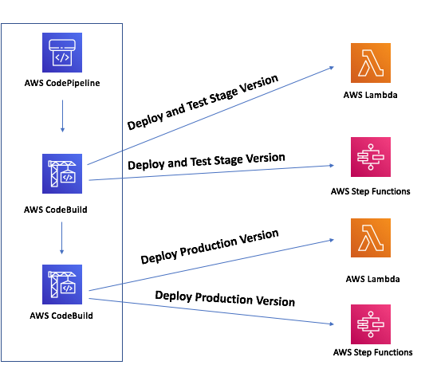
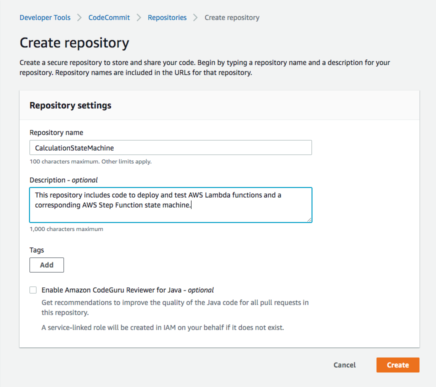
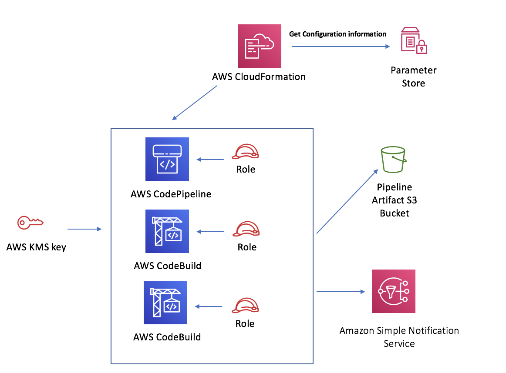

# AWS Step Function CI/CD Pipeline

> Create a CI/CD Pipeline to test and deploy a Step Function State Machine.

## Overview

This project shows you how to use AWS CodePipeline, AWS CodeBuild, and Serverless Application Model (SAM) to test and deploy an AWS Step Function state machine. This example enables developers to have more confidence that their Step Functions are performing as they would expect before releasing them to production.

## Solution Overview



This project will create a CodePipeline project that performs the following steps:

1. Pull source code from AWS CodeCommit.
2. Lint AWS Step Function Amazon States Language (ASL) definition.
3. Run unit tests against AWS Lambda functions that back the state machine.
4. Use SAM to deploy stage versions of AWS Lambda functions.
5. Build CloudFormation template artifact for releasing stage state machine.
6. Deploy stage CloudFormation template to create stage state machine.
7. Run end-to-end tests against stage Step Function state machine.
8. Send production release approval email to approvers.
9. Run CloudFormation delete against stage stack.
10. Build CloudFormation template artifact for releasing prod state machine.
11. Use SAM to deploy production version of AWS Lambda functions.
12. Deploy prod CloudFormation template to create prod state machine.

## Pre-requisites

- Create or use an existing AWS account
- Install Python >= 3.7
- Git Client is installed on your desktop
- Install AWS CLI (if deploying pipeline with CLI)
- OpenSSL is installed or you have another way to Base64 encode a string

## Breakdown of Directories

- [cloudformation](cloudformation) = this directory contains two CloudFormation templates. The first one is called `codepipeline_ci_cd.yaml` and is used to stand up the CodeBuild projects and the CodePipeline project. The second one is called `lambda_deployer.yaml` and this is used for deploying Lambda functions using SAM.
- [config](config) = this directory contains a sub-directory called `codebuild` and contains all of the CodeBuild BuildSpec files used for the various stages in the CI/CD pipeline.
- [lambdas](lambdas) = this directory contains a collection of sub-folders which encompass the lambda functions that will be invoked when the Step Function state machine executes.
- [tests](tests) = this directory contains two sub-folders and is contains all of the needed tests for checkout of the pipeline. The first sub-folder is called [unit](tests/unit) and contains all of the unit tests needed to test the Lambda functions. The second folder is called [e2e](tests/e2e) and contains all of the end-to-end tests that are run against the Step Function state machine.

## Deployment Steps

### Clone repository locally

First, clone this repository to your local machine using a command like below:

```sh
$ git clone ${THIS_REPOSITORY_URL}
```

### Create AWS CodeCommit Repository

Navigate to the AWS console and search for `CodeCommit`. Once on this page, click on `Create repository`.

Create a new repository with the name of `CalculationStateMachine`, as seen below:



### Push Repository Code

After you have created the CodeCommit repository, you will need to delete the existing git remote and repoint it to CodeCommit using the following command:

```sh
$ git remote rm origin
$ git remote add origin https://git-codecommit.us-east-1.amazonaws.com/v1/repos/CalculationStateMachine
$ git add -A
$ git commit -m "Adding all files for state machine pipeline creation"
$ git push -u origin master
```

### Create Systems Manager Parameter Store Value

Now that you have pushed this repository into CodeCommit, you will now create a parameter in AWS Systems Manager Parameter Store. This parameter is a Base64 Encoded JSON object that contains the names of the Lambda functions that you will deploy for your Step Function state machine.

Run the following command to create the parameter:

```sh
aws ssm put-parameter \
    --name "StateMachineLambdaFunctions" \
    --value "eyJTdGFnZSI6IFsgeyJDTEVBTklOUFVUX0ZVTkNUSU9OIjogIkNsZWFuSW5wdXQtU3RhZ2UiLAogICJNVUxUSVBMWV9GVU5DVElPTiI6ICJNdWx0aXBseS1TdGFnZSIsCiAgIkFERF9GVU5DVElPTiI6ICJBZGQtU3RhZ2UiLAogICJTVUJUUkFDVF9GVU5DVElPTiI6ICJTdWJ0cmFjdC1TdGFnZSIsCiAgIkRJVklERV9GVU5DVElPTiI6ICJEaXZpZGUtU3RhZ2UifV0sIlByb2QiOiBbeyJDTEVBTklOUFVUX0ZVTkNUSU9OIjogIkNsZWFuSW5wdXQiLAogICJNVUxUSVBMWV9GVU5DVElPTiI6ICJNdWx0aXBseSIsCiAgIkFERF9GVU5DVElPTiI6ICJBZGQiLAogICJTVUJUUkFDVF9GVU5DVElPTiI6ICJTdWJ0cmFjdCIsCiAgIkRJVklERV9GVU5DVElPTiI6ICJEaXZpZGUifV19" \
    --type String
```

The decoded value is:

```sh
{
  "Stage": [
    {
      "CLEANINPUT_FUNCTION": "CleanInput-Stage",
      "MULTIPLY_FUNCTION": "Multiply-Stage",
      "ADD_FUNCTION": "Add-Stage",
      "SUBTRACT_FUNCTION": "Subtract-Stage",
      "DIVIDE_FUNCTION": "Divide-Stage"
    }
  ],
  "Prod": [
    {
      "CLEANINPUT_FUNCTION": "CleanInput",
      "MULTIPLY_FUNCTION": "Multiply",
      "ADD_FUNCTION": "Add",
      "SUBTRACT_FUNCTION": "Subtract",
      "DIVIDE_FUNCTION": "Divide"
    }
  ]
}
```

This command above will create a new SSM entry with the Base64 Encoded value of the JSON payload above.

### Bootstrap Pipeline CloudFormation Template

The CloudFormation template for bootstrapping the CodePipeline project is located at [codepipeline_ci_cd.yaml](cloudformation/codepipeline_ci_cd.yaml)

Now that you have created the CodeCommit repository and the Systems Manager Parameter Store value you are ready to create the CloudFormation stack to set up the following resources:

- AWS CodePipeline Project
- AWS CodeBuild Steps
- S3 Lambda SAM staging Bucket
- S3 CodePipeline artifact Bucket
- IAM CodePipeline and CodeBuild Execution Roles and Policies
- SNS Production Approval Topic and email subscriber
- KMS CodePipeline encryption key



The CloudFormation stack can be created via the CLI or the AWS console.

_NOTE:_ you will need to accept the SNS topic subscription via the email that gets generated from AWS.

### Create Stack using the AWS CLI (option 1)

```sh
$ aws cloudformation deploy --template-file cloudformation/codepipeline_ci_cd.yaml --stack-name step-function-cicd-pipeline --parameter-overrides ProductionApprovalEmail=example@myemail.com StateMachineName=CalculationStateMachine CodeCommitRepository=CalculationStateMachine CodeCommitBranch=master
```

### Create Stack using the AWS Console (option 2)

Navigate to the AWS Console and then to CloudFormation. Once here, upload the template `cloudformation/codepipeline_ci_cd.yaml` and then provide the parameters or override the existing default values.

### CodePipeline CloudFormation Parameters

These are the parameters that are specified in the `--parameters-override` section of the CloudFormation Deployment command above. These also correspond to the parameters section of the CloudFormation template itself.

- StateMachineName = this is the name that the Step Function state machine will be given when it is deployed.
- CodeCommitRepository = this is the name of the AWS CodeCommit repository where this code base will reside.
- CodeCommitBranch = this is the AWS CodeCommit Branch name that we will pull when running the AWS CodePipeline execution.
- ProductionApprovalEmail = this is the email address that will be notified via an SNS Topic Subscription when a Production Approval is requested.

## Useful Examples

### SSM Base64 Encoded Parameter Example

This is an example of the value of the JSON object as a Base64 Encoded object:

```sh
eyJTdGFnZSI6IFsgeyJDTEVBTklOUFVUX0ZVTkNUSU9OIjogIkNsZWFuSW5wdXQtU3RhZ2UiLAogICJNVUxUSVBMWV9GVU5DVElPTiI6ICJNdWx0aXBseS1TdGFnZSIsCiAgIkFERF9GVU5DVElPTiI6ICJBZGQtU3RhZ2UiLAogICJTVUJUUkFDVF9GVU5DVElPTiI6ICJTdWJ0cmFjdC1TdGFnZSIsCiAgIkRJVklERV9GVU5DVElPTiI6ICJEaXZpZGUtU3RhZ2UifV0sIlByb2QiOiBbeyJDTEVBTklOUFVUX0ZVTkNUSU9OIjogIkNsZWFuSW5wdXQiLAogICJNVUxUSVBMWV9GVU5DVElPTiI6ICJNdWx0aXBseSIsCiAgIkFERF9GVU5DVElPTiI6ICJBZGQiLAogICJTVUJUUkFDVF9GVU5DVElPTiI6ICJTdWJ0cmFjdCIsCiAgIkRJVklERV9GVU5DVElPTiI6ICJEaXZpZGUifV19
```

### Base64 Encoding JSON object

In order to base64 encode the JSON object above, run the following command:

```sh
$ export VAL='{"Stage": [ {"CLEANINPUT_FUNCTION": "CleanInput-Stage",
  "MULTIPLY_FUNCTION": "Multiply-Stage",
  "ADD_FUNCTION": "Add-Stage",
  "SUBTRACT_FUNCTION": "Subtract-Stage",
  "DIVIDE_FUNCTION": "Divide-Stage"}],"Prod": [{"CLEANINPUT_FUNCTION": "CleanInput",
  "MULTIPLY_FUNCTION": "Multiply",
  "ADD_FUNCTION": "Add",
  "SUBTRACT_FUNCTION": "Subtract",
  "DIVIDE_FUNCTION": "Divide"}]}'

$ echo -n $VAL | openssl base64
```

## Lambda Deployer SAM Template

There is a [SAM Template](cloudformation/lambda_deployer.yaml) which will get used in one of the CodeBuild steps to deploy all of the Lambda Functions. This will use an All-at-Once deployment approach and will set up all of the necessary Lambda Versions, Lambda Aliases, and appropriate Lambda Functions.

## License

This library is licensed under the MIT-0 License. See the LICENSE file.

